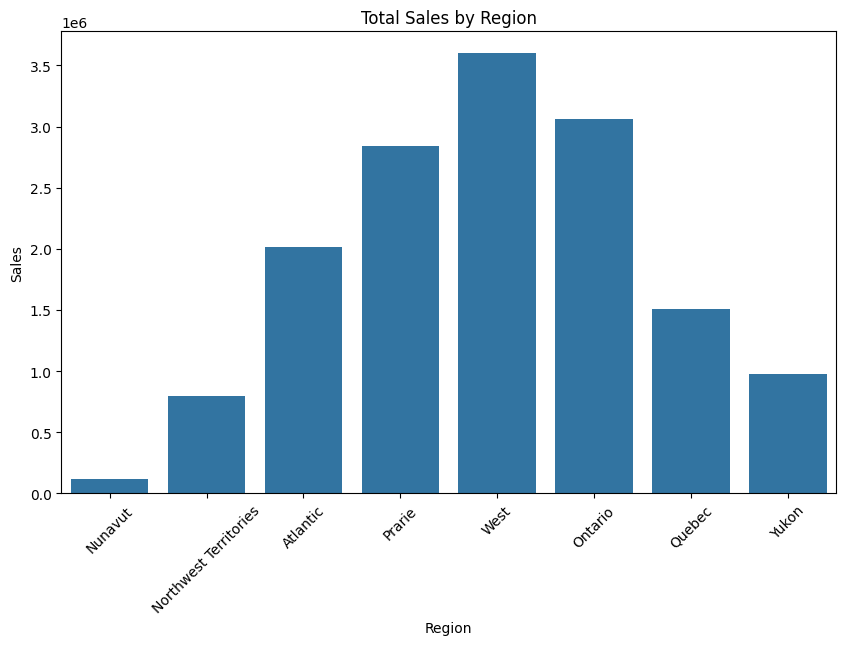

# 📊 Kultra Mega Stores Business Intelligence Case Study

This project is a complete Business Intelligence analysis of sales data from **Kultra Mega Stores (KMS)**, a leading office supplies and furniture retailer headquartered in Lagos, Nigeria. Conducted as part of the DSA Data Analysis program, the project applies SQL and Python skills to derive actionable insights for the company’s **Abuja division** based on sales activity from **2009 to 2012**.

---

## 🏢 Company Overview

Kultra Mega Stores (KMS) serves a diverse clientele that includes:
- **Individual Consumers**
- **Small Businesses (Retail)**
- **Large Corporate Clients (Wholesale)**

As a **Business Intelligence Analyst**, I was tasked with analyzing their historical order data — provided as an Excel file — and answering specific business questions under two scenarios, while also building a supporting visual and analytical report.

---

## 🧠 Project Objectives

### ✅ **Case Scenario I: Operational & Sales Insights**
1. Identify the **product category with the highest sales**.
2. Determine the **Top 3 and Bottom 3 regions** by sales volume.
3. Calculate the **total sales of Appliances in Ontario**.
4. Advise management on **strategies to increase revenue** from the **bottom 10 customers**.
5. Discover which **shipping method incurred the highest shipping cost**.

### ✅ **Case Scenario II: Customer Intelligence**
6. Identify the **most valuable customers** and their **product/service preferences**.
7. Highlight the **top-performing small business customer** by sales.
8. Find the **corporate customer with the highest number of orders** between 2009–2012.
9. Identify the **most profitable consumer customer**.
10. Determine **customers who returned items** and their **segments**.
11. Analyze whether **shipping method costs align with order priorities** (e.g., Delivery Truck vs. Express Air).

---

## 🧰 Tools & Technologies Used

| Tool         | Purpose                          |
|--------------|----------------------------------|
| **SQL Server Management Studio (SSMS)** | Data querying, aggregation, and filtering |
| **Google Colab** | Data exploration, visualization (EDA) |
| **Python** + `pandas`, `seaborn`, `matplotlib`, `plotly` | EDA and visualization |
| **Excel** | Data inspection and CSV transformation |

---
kultra-mega-stores-bi-project/
│

├── data/

│   ├── raw/ 
# Original Excel file

│   └── processed/                  # Cleaned CSV from SQL

│
├── sql/

│   ├── schema.sql                  # Table creation script

│   ├── queries_case_scenario_1.sql  # Scenario I queries

│   └── queries_case_scenario_2.sql  # Scenario II queries

│
├── notebooks/

│   └── kms_eda.ipynb               # Full EDA & visualizations in Colab

│
├── reports/
│   └── executive_summary.pdf       # Key insights & recommendations

│
├── images/
│   └── charts/                     # Screenshots of key plots

│
├── requirements.txt                # Python dependencies
└── README.md                       # Project overview (this file)


## 📌 Key Findings

- **Office Supplies** was the highest-selling product category across regions.
- **West, East, and Central** were the top-performing regions by sales.
- The **Delivery Truck**, while economical, was frequently used for high-priority orders — this indicates **inefficiencies in logistics**.
- Several **bottom-tier customers** showed potential based on order frequency but lacked volume — suggesting a targeted campaign could improve revenue.
- **Small business customers** drove significant sales but with **lower profit margins** compared to **corporate clients**.

---

## 📊 Sample Visual



---

## 📈 How to Run

> Clone the repo and run the notebook in Google Colab.

```bash
git clone https://github.com/yourusername/kultra-mega-stores-bi-project.git
cd kultra-mega-stores-bi-project

# Install dependencies
pip install -r requirements.txt
📑 Business Recommendations
Improve logistics by aligning order priority with appropriate shipping methods.

Launch targeted promotions for underperforming customer segments.

Monitor shipping costs for high-frequency customers to optimize margins.

Focus retention efforts on top 5 most profitable customers with personalized incentives.

🤝 Contributions
This project was completed as part of the DSA Data Analysis training program.
Feel free to fork, study, or adapt for your own BI case study portfolio.

🧾 License
MIT License. For educational use only.


---

Let me know if you'd like me to generate this README as a real file, or help you auto-create the full GitHub folder structure locally or via Colab.
